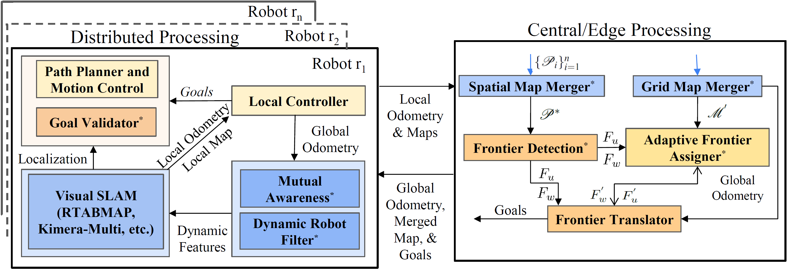

# SPACE
This repository contains the ROS package that implements the works from the algorithm "SPACE: 3D Spatial Co-operation and Exploration Framework for Robust Mapping and Coverage with Multi-Robot Systems". The following figure shows the conceptual overview of SPACE:




### Publication/Citation
If you use this work, please cite our paper: 
Preprint available at 

### Experiemental Demonstration and Video

## 1. Requirements & Environment Setup
The package has been tested on both ROS Noetic for both simulated and hardware Turtlebot3 robot (waffle) & Turtlebot2 (2e and 2i). The following requirements are needed before installing the package:

1. **ROS Installation**: You should have installed a ROS distribution (Noetic) on Ubuntu 20.04.
2. **Workspace Creation**: Make sure you have created a ROS workspace. You can follow the ROS [tutorial](http://wiki.ros.org/catkin/Tutorials/create_a_workspace) to do this.
3. **Install `rtabmap` ROS Package**: Install the `rtabmap` package with the following command:
    ```bash
    sudo apt-get install ros-noetic-rtabmap-ros
    ```
4. **Install ROS Navigation Stack**: You can install the ROS navigation stack using the following command:
    ```bash
    sudo apt-get install ros-noetic-navigation
    ```
6. **Python Modules Installation**: Make sure python version is 3.8+. Install the following Python modules using `pip`:
    ```bash
    pip install numpy pandas matplotlib open3d opencv-python scikit-learn
    ```
7. **Turtlebot3 Installation**:
    ```bash
    cd ~/catkin_ws/src/
    git clone https://github.com/ROBOTIS-GIT/turtlebot3_simulations.git
    echo "export TURTLEBOT3_MODEL=waffle" >> ~/.bashrc
    source ~/.bashrc
    sudo apt-get install ros-noetic-turtlebot3*
    ```
    
8. **AWS Gazebo Worlds Installation**:
    ```bash
    cd ~/catkin_ws/src/
    https://github.com/aws-robotics/aws-robomaker-small-house-world.git
    https://github.com/aws-robotics/aws-robomaker-bookstore-world.git
    ```

9. **Move_Base Navigation**:
    ```bash
    sudo apt-get install ros-$ROS_noetic-move-base
    ```
10. **Environment Initialization**:
    ```bash
    cd ~/catkin_ws/src/
    git clone https://github.com/herolab-uga/SPACE-MAP.git
    catkin_make
    source devel/setup.bash
    ```
    
## ROS Nodes
- **Gazebo Simulation**: Launches simulation environments like AWS house or bookstore (mentioned in .launch files).
- **Robot State Publisher**: Publishes robot state from URDF at a frequency of 100 Hz.
- **Model Spawner**: Places TurtleBot3 models in Gazebo at specified coordinates.
- **RTAB-Map SLAM**: SLAM system using RGB-D input, operates at specified frequencies and saves data to a path.
- **RGBD Synchronization**: Synchronizes RGB and depth images for SLAM with adjustable settings.
- **RTAB-Map Visualization**: Visualization node for RTAB-Map outputs and odometry.
- **Dynamic Robot Filters**: The Dynamic Robot Filters subsribes to global odometry and filters the dynamic feature for mapping.
- **Map Merger**: Merge all the grid maps with unknown init positions
- **Move Base**: Manages path planning and navigation using local and global costmaps.
- **Spatial Map Merger**: Combines spatial maps from individual robots into a comprehensive global map.
- **Frontier Assigner**: Assigns exploration tasks to robots based on predefined rates.

## ROS Topics
robot_namespace = {tb3_0, tb3_1, tb3_2, tb3_3, tb3_4, tb3_5}
target_name = namespace of robots which is in field-of-view

- `${robot_namespace}/odom`: Provides odometry data.
- `${robot_namespace}/cmd_vel`: Issues velocity commands.
- `${robot_namespace}/cloud_map`: Outputs RTABMap individual maps.
- `${robot_namespace}/scan`: Laser scan data for navigation.
- `${robot_namespace}/camera/rgb/image_raw` & `/camera/depth/image_raw`: Image streams from robot cameras.
- `${robot_namespace}/camera/rgb/camera_info`: Metadata for the RGB cameras.
- `{robot_namespace}/move_base`: Each Robot Move Base server for navigation
- `/total_cloud_map`: Outputs spatial merged map.
- `/total_map`: Outputs merged 2D grid map.
- `/frontier_marker`: 3D & 2D Spatial Frontiers
- `/{target_name}/masker/masked_image_raw`: Features are masked and republished for mapping.

## Launch
afsd

    ```bash
    roslaunch <package_name> 3_house.launch
    ```
    
## Contributions

- **Sai Krishna Ghanta** - PhD Candidate
- **Dr. Ramviyas Parasuraman** - Lab Director

### [Heterogeneous Robotics Lab](https://hero.uga.edu/)
School of Computing, University of Georgia.

For further information, please contact Dr. Ramviyas Parasuraman at [ramviyas@uga.edu](mailto:ramviyas@uga.edu). 


